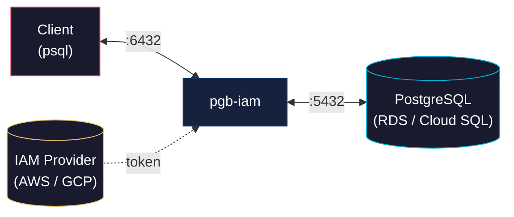
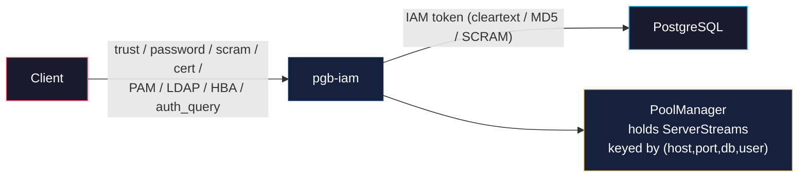
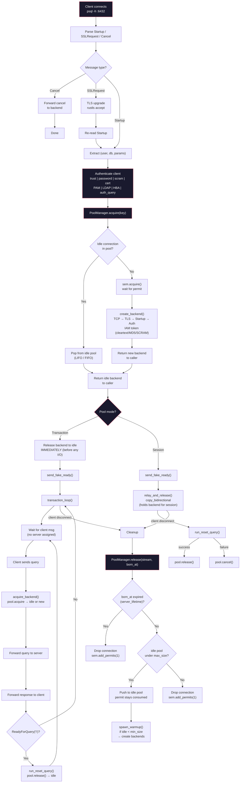

# pgb-iam — IAM-Aware PostgreSQL Connection Pooler

## The Problem

PgBouncer is the de facto PostgreSQL connection pooler, but it has a glaring gap in 2025+: **IAM-based database authentication**.

Teams running PostgreSQL on AWS RDS or GCP Cloud SQL want to use IAM auth (short-lived tokens via AWS `GenerateDBAuthToken` or GCP's Cloud SQL IAM) instead of static passwords. However, PgBouncer's auth model is built around static password files (`userlist.txt`) or SCRAM authentication. Getting IAM tokens to work with PgBouncer requires:

- External cron jobs or sidecars that refresh tokens every ~15 minutes
- Writing tokens to files that PgBouncer re-reads via `auth_query`
- Complex `auth_user` setups with shadow tables
- No native token refresh — if a token expires, connections start failing until manual intervention

This is fragile, operationally expensive, and undermines the security benefits of IAM auth.

## The Solution

**pgb-iam** is a PostgreSQL connection pooler built from the ground up for cloud-native deployments. It natively understands IAM authentication and handles token lifecycle automatically.

### Core Design



### Two-Level Authentication



1. **Client connection**: Authenticates to pgb-iam locally via any of 8 methods: `trust`, `password` (cleartext), `scram-sha-256` (SASL), `cert` (TLS client certificate), `PAM`, `LDAP`, `hba` (pg_hba.conf-style rules), or `auth_query` (dynamic DB lookup)
2. **Backend connection**: pgb-iam authenticates to PostgreSQL using IAM tokens (AWS RDS `GenerateDBAuthToken` / GCP Cloud SQL IAM) — supports `cleartext`, `MD5`, and `SCRAM-SHA-256` SASL for the backend auth handshake
3. **Pooling**: Already-authenticated backend connections are stored in a per-`(host, port, db_user, dbname)` pool
4. **Token lifecycle**: Tokens are cached and auto-refreshed via background task (10-min TTL, 5-min refresh check)

### Why Rust

- **Performance**: Async I/O with Tokio — ideal for connection pooling, zero-cost abstractions, no GC pauses
- **Safety**: No buffer overflows or use-after-free in the critical network path
- **Ecosystem**: First-class AWS SDK, async Postgres protocol support, Prometheus instrumentation

## Feature Comparison with PgBouncer

### Pooling

| Feature | PgBouncer | pgb-iam | Notes |
|---|---|---|---|
| Session pooling | ✅ | ✅ | Server assigned for client lifetime |
| Transaction pooling | ✅ | ✅ | Server released on ReadyForQuery('I') |
| Statement pooling | ✅ | ❌ | Not implemented |
| Per-database pool size | ✅ | ✅ | `[pool.database_limits]` table |
| Per-user pool size | ✅ | ✅ | `[pool.user_limits]` table |
| Reserve pool | ✅ | ✅ | `reserve_size` — burst beyond `max_size` |
| LIFO / round-robin | ✅ | ✅ | LIFO default; `strategy = "fifo"` opt-in |
| Min pool size (warm-up) | ✅ | ✅ | `min_size` — background spawn after relay |

### Authentication

| Feature | PgBouncer | pgb-iam | Notes |
|---|---|---|---|
| Cleartext password | ✅ | ✅ | IAM token sent as cleartext |
| MD5 password | ✅ | ✅ | IAM token MD5-hashed with server salt |
| SCRAM-SHA-256 | ✅ | ✅ | Full SASL exchange (server + client) |
| PAM | ✅ | ✅ | Custom FFI — no external dependencies |
| LDAP | ✅ | ✅ | Async ldap3 bind + search + user verification |
| TLS client cert | ✅ | ✅ | `client_ca` config, `WebPkiClientVerifier` |
| HBA (host-based) | ✅ | ✅ | Inline matching by conn_type/db/user/address/TLS |
| `auth_query` (DB lookup) | ✅ | ✅ | `SELECT ... FROM pg_shadow WHERE usename = $1` |
| **AWS RDS IAM** | ❌ | ✅ | Full `GenerateDBAuthToken` integration |
| **GCP Cloud SQL IAM** | ❌ | ⚠️ | Stub only |
| **Auto token refresh** | ❌ | ✅ | Background task, 5-min cycle |

### TLS

| Feature | PgBouncer | pgb-iam | Notes |
|---|---|---|---|
| Client TLS | ✅ Full | ✅ | rustls accept with optional client CA |
| Server TLS | ✅ Full | ⚠️ | `connect_with_tls: bool` only |
| Cipher / protocol selection | ✅ | ✅ | Configurable via `ciphers` and `min_protocol_version` |
| Client cert validation | ✅ | ✅ | `client_ca` → `WebPkiClientVerifier` |

### Protocol

| Feature | PgBouncer | pgb-iam | Notes |
|---|---|---|---|
| Wire protocol (startup, auth, relay) | ✅ | ✅ | Full basic flow |
| SSLRequest / TLS upgrade | ✅ | ✅ | rustls accept/connect |
| Extended query protocol | ✅ | ⚠️ | Message types defined; relayed as opaque bytes |
| Prepared statement tracking | ✅ | ✅ | Tracked per connection; DEALLOCATE on release |
| Cancel request | ✅ | ✅ | Parsed and forwarded on separate backend connection |
| Replication protocol | ✅ | ❌ | Not implemented |

### Timeouts

| Feature | PgBouncer | pgb-iam | Notes |
|---|---|---|---|
| `server_idle_timeout` | ✅ | ✅ | `idle_timeout_secs` in config |
| `server_lifetime` | ✅ | ✅ | `server_lifetime_secs` — enforced on pool release |
| `server_connect_timeout` | ✅ | ✅ | `server_connect_timeout_secs` — in `create_backend` |
| `query_timeout` | ✅ | ❌ | Not implemented |
| `client_idle_timeout` | ✅ | ✅ | Enforced in `transaction_loop` |
| `transaction_timeout` | ✅ | ✅ | Enforced in `transaction_loop` |
| `query_wait_timeout` | ✅ | ✅ | Enforced in `transaction_loop` |

### Admin & Monitoring

| Feature | PgBouncer | pgb-iam | Notes |
|---|---|---|---|
| Admin console (`psql pgbouncer`) | ✅ | ❌ | HTTP JSON API instead |
| SHOW commands (stats, pools, clients) | ✅ | ❌ | `GET /stats`, `GET /health` |
| RECONNECT / PAUSE / RESUME / RELOAD | ✅ | ❌ | No live admin commands |
| Online restart (`-R`) | ✅ | ❌ | Restart required for config changes |
| Prometheus metrics | ⚠️ via SHOW + exporter | ✅ | Native `GET /metrics` |

### Configuration

| Feature | PgBouncer | pgb-iam | Notes |
|---|---|---|---|
| Config format | INI | TOML | Cleaner format |
| Per-database settings | ✅ | ✅ | `[pool.database_limits]` table |
| Per-user settings | ✅ | ✅ | `[pool.user_limits]` table |
| Online reload (SIGHUP) | ✅ | ❌ | Not implemented |

### Other

| Feature | PgBouncer | pgb-iam | Notes |
|---|---|---|---|
| Unix sockets | ✅ | ❌ | TCP only |
| SO_REUSEPORT (multi-process) | ✅ | ❌ | Single-process async |
| `server_reset_query` | ✅ | ✅ | `DISCARD ALL` (configurable) |
| `PoolManager` + `PoolKey` | ❌ | ✅ | Keyed by `(host, port, db_user, dbname)` |
| `ServerStream` (Plain/TLS) | ❌ | ✅ | Unified I/O enum |
| Two-level auth (local + IAM) | ❌ | ✅ | Unique to pgb-iam |

## Quick Start

```bash
# Build
cargo build --release

# Configure
cp config.toml config.toml
# edit config.toml with your RDS endpoint and IAM settings

# Run
./target/release/pgb-iam -c config.toml

# Metrics
curl http://127.0.0.1:9090/metrics
```

## Pool Lifecycle



## Architecture

```
src/
├── main.rs          Entry point, config loading, runtime setup
├── config/          TOML config deserialization (listen, pool, client_auth, iam, tls, metrics, admin, health_check)
├── pool/            PoolManager — maps of pools keyed by (host, port, db_user, dbname), acquire/release lifecycle
├── proxy/           TCP relay + IAM auth injection + pool mode dispatch
│   ├── mod.rs       Handler: client TLS → startup → local auth → pool acquire → relay
│   ├── health.rs    Periodic backend health checks (TCP connect)
│   └── admin.rs     HTTP admin API (GET /stats, GET /health)
├── pgproto/         PostgreSQL wire protocol parser (startup, SSL, auth messages, relay)
├── auth/            IAM token providers, SCRAM, HBA, auth_query, PAM, LDAP + token cache
│   ├── aws.rs       AWS RDS GenerateDBAuthToken
│   ├── gcp.rs       GCP Cloud SQL IAM (stub)
│   ├── cache.rs     Token cache with auto-refresh (10-min TTL)
│   ├── scram.rs     SCRAM-SHA-256 client + server
│   ├── hba.rs       HBA rule parser (conn_type/db/user/address matching)
│   ├── auth_query.rs Dynamic password lookup from PostgreSQL
│   ├── pam_ffi.rs   Minimal PAM FFI (libpam bindings)
│   ├── pam.rs       PAM authentication wrapper
│   └── ldap.rs      LDAP authentication (async ldap3)
├── tls/             TLS accept/connect (rustls + tokio-rustls)
└── metrics/         Prometheus endpoint (GET /metrics)
```

## Configuration Reference

### `[listen]` — TCP bind address

| Key | Type | Default | Description |
|---|---|---|---|
| `addr` | string | `"127.0.0.1"` | IP address to bind |
| `port` | integer | `6432` | TCP port to listen on |

---

### `[pool]` — Connection pool behavior

| Key | Type | Default | Description |
|---|---|---|---|
| `mode` | enum | `"session"` | `"session"` — backend held for client lifetime; `"transaction"` — released after each transaction |
| `strategy` | enum | `"lifo"` | `"lifo"` — most recently used recycled first; `"fifo"` — oldest first |
| `max_size` | integer | **required** | Maximum backend connections in pool (excluding reserve) |
| `min_size` | integer | `0` | Background warm-up target — pool spawns this many connections after first relay |
| `reserve_size` | integer | `0` | Extra capacity beyond `max_size` for burst traffic; uses a separate semaphore |
| `idle_timeout_secs` | integer | `300` | Idle connection removed from pool after this many seconds |
| `server_lifetime_secs` | integer | `3600` | Connection dropped after this many seconds from creation (enforced on release) |
| `server_connect_timeout_secs` | integer | `15` | Max seconds to wait for TCP + TLS + PostgreSQL handshake per backend |
| `client_idle_timeout_secs` | integer | `0` | Max seconds a client can stay idle without a transaction (0 = disabled) |
| `transaction_timeout_secs` | integer | `0` | Max seconds a single transaction can run (0 = disabled) |
| `query_wait_timeout_secs` | integer | `0` | Max seconds a query can wait for a backend connection (0 = disabled) |
| `target_host` | string | **required** | PostgreSQL hostname or IP |
| `target_port` | integer | **required** | PostgreSQL port |
| `dbname` | string | **required** | Default database name |
| `db_user` | string | **required** | PostgreSQL user that pgb-iam connects as (used for IAM auth) |
| `server_reset_query` | string | `"DISCARD ALL"` | SQL sent to reset backend state before returning to pool |
| `client_max` | integer | `0` | Maximum concurrent client connections (0 = unlimited) |

**Timeout behavior**: A value of `0` disables the timeout (equivalent to infinite).

---

### `[pool.database_limits]` — Per-database pool limits

Overrides the global `max_size`, `min_size`, and `reserve_size` for specific databases:

```toml
[pool.database_limits]
"postgres" = { max_size = 2, min_size = 1, reserve_size = 1 }
"myapp" = { max_size = 50 }
```

Any unset limit inherits the value from `[pool]`.

---

### `[pool.user_limits]` — Per-user pool limits

Same structure as `database_limits` but limits connections for a specific `db_user`:

```toml
[pool.user_limits]
"admin" = { max_size = 15 }
"readonly" = { max_size = 5 }
```

---

### `[client_auth]` — Client authentication

Controls how pgb-iam verifies incoming client connections. Only one `[client_auth]` block is active at a time (unless using HBA, which dispatches per-connection).

| Key | Type | Default | Description |
|---|---|---|---|
| `type` | enum | **required** | Authentication method (see below) |
| `password` | string | none | Static password for `password` / `scram-sha-256` methods |
| `client_ca` | string | none | Path to CA PEM file for `cert` method (requires `[tls].enabled = true`) |
| `pam_service` | string | `"pgb-iam"` | PAM service name for `pam` method |

**`type` values:**

| Value | Description |
|---|---|
| `"trust"` | Accept all connections without credentials |
| `"password"` | Cleartext password — matched against `password` field or `[client_auth.auth_query]` |
| `"scram-sha-256"` | Full SASL SCRAM-SHA-256 exchange |
| `"cert"` | TLS client certificate validated against `client_ca` (requires client TLS) |
| `"pam"` | Delegates to system PAM via `pam_service` |
| `"ldap"` | LDAP bind + search (see `[client_auth.ldap]`) |
| `"hba"` | Evaluates `[[client_auth.hba_rules]]` in order |
| `"auth_query"` | Dynamic password lookup from PostgreSQL (see `[client_auth.auth_query]`) |

---

### `[client_auth.auth_query]` — Dynamic password lookup

Required when `client_auth.type` is `"password"`, `"scram-sha-256"`, or `"hba"` and passwords come from the database:

| Key | Type | Description |
|---|---|---|
| `user` | string | PostgreSQL user that pgb-iam connects as for the lookup |
| `query` | string | SQL returning the password (e.g., `"SELECT passwd FROM pg_shadow WHERE usename = $1"`) |

The `$1` placeholder is replaced with the client's username.

---

### `[client_auth.ldap]` — LDAP configuration

Required when `client_auth.type` is `"ldap"`:

| Key | Type | Description |
|---|---|---|
| `uri` | string | LDAP server URI (e.g., `"ldap://ldap.example.com"`) |
| `bind_dn` | string | Admin bind DN |
| `bind_password` | string | Admin bind password |
| `search_base` | string | Base DN for user search |
| `search_filter` | string | Filter with `$1` placeholder for client username (e.g., `"(uid=$1)"`) |

---

### `[[client_auth.hba_rules]]` — Host-based authentication rules

Evaluated in order for each connection. The first matching rule determines the auth method. Required when `client_auth.type` is `"hba"`.

| Key | Type | Description |
|---|---|---|
| `type` | enum | `"host"` (any), `"hostssl"` (TLS required), `"hostnossl"` (TLS disabled) |
| `database` | string array | `["all"]`, `["sameuser"]`, or specific database names |
| `user` | string array | `["all"]` or specific user names |
| `address` | string | CIDR notation (e.g., `"0.0.0.0/0"`, `"10.0.0.0/8"`) |
| `auth` | enum | `"trust"`, `"reject"`, `"password"`, `"scram-sha-256"`, `"cert"`, `"pam"`, `"ldap"` |

If no rule matches, the connection is **rejected**.

---

### `[iam]` — IAM provider

Controls how pgb-iam authenticates to PostgreSQL backends. When configured, pgb-iam generates short-lived IAM tokens instead of using static passwords.

| Key | Type | Description |
|---|---|---|
| `provider` | enum | `"aws"`, `"gcp"`, or `"none"` |
| `region` | string | AWS region (required for `"aws"`) |
| `instance_host` | string | Database instance hostname (must match the IAM policy) |
| `instance_port` | integer | Database port (default `5432`) |
| `db_user` | string | IAM database user name |

**AWS IAM**: Uses `GenerateDBAuthToken` via the AWS SDK. Credentials resolved at runtime: environment variables → `~/.aws/credentials` → `~/.aws/login/cache/*.json` (supports `aws login` extension).

**GCP IAM**: Resolves tokens from `GCP_ACCESS_TOKEN` env var → GCP metadata server (`metadata.google.internal`). Requires the Cloud SQL Client IAM role on the service account.

**Token caching**: Tokens are cached for 10 minutes with a background refresh task checking every 5 minutes.

---

### `[tls]` — TLS configuration

| Key | Type | Default | Description |
|---|---|---|---|
| `enabled` | boolean | `false` | Enable TLS for client connections |
| `cert_path` | string | `"server.crt"` | Path to server certificate PEM |
| `key_path` | string | `"server.key"` | Path to server private key PEM |
| `connect_with_tls` | boolean | `false` | Connect to PostgreSQL with TLS |
| `backend_ca_path` | string | none | Path to backend CA bundle PEM (e.g., RDS `global-bundle.pem`) |
| `ciphers` | string array | none | Allowed TLS cipher suites (e.g., `["TLS13_AES_256_GCM_SHA384"]`) |
| `min_protocol_version` | string | none | Minimum TLS version (e.g., `"TLSv1.2"`) |

When `enabled = true`, clients must connect with TLS to port 6432. The optional `client_ca` in `[client_auth]` enables client certificate authentication.

When `connect_with_tls = true`, all backend connections use TLS. Required for AWS RDS IAM auth.

---

### `[metrics]` — Prometheus metrics endpoint

| Key | Type | Default | Description |
|---|---|---|---|
| `enabled` | boolean | `true` | Enable metrics HTTP server |
| `listen_addr` | string | `"127.0.0.1"` | Metrics bind address |
| `listen_port` | integer | `9090` | Metrics HTTP port |

**Exported metrics**: `pgb_iam_clients`, `pgb_iam_client_max`, `pgb_iam_server_active`, `pgb_iam_server_idle`, `pgb_iam_server_max`, `pgb_iam_server_reserve`, `pgb_iam_server_min`.

```
GET /metrics  → Prometheus text format
GET /health   → "ok"
```

---

### `[admin]` — Admin HTTP API

| Key | Type | Default | Description |
|---|---|---|---|
| `enabled` | boolean | `true` | Enable admin HTTP server |
| `listen_addr` | string | `"127.0.0.1"` | Admin bind address |
| `listen_port` | integer | `9091` | Admin HTTP port |

```
GET /stats   → JSON pool statistics (idle, active, max, reserve, min)
GET /health  → JSON health status (healthy, last_error, last_check_ago_secs)
```

---

### `[health_check]` — Backend health monitoring

Periodically checks PostgreSQL reachability via TCP connect.

| Key | Type | Default | Description |
|---|---|---|---|
| `enabled` | boolean | `true` | Enable periodic health checks |
| `interval_secs` | integer | `30` | Seconds between checks |
| `timeout_secs` | integer | `5` | TCP connect timeout in seconds |

---

### `[logging]` — Structured logging

Controls output format and destination. Each output channel is independently configured.

| Key | Type | Default | Description |
|---|---|---|---|
| `stderr` | enum | `"text"` | `"text"` or `"json"` — format for stderr |
| `stdout` | enum | unset | `"text"` or `"json"` — enables stdout output (unset = disabled) |
| `pipeline_path` | string | none | File path for pipeline log output |
| `pipeline_format` | enum | `"json"` | `"text"` or `"json"` — format for pipeline file |

**Examples:**

```toml
# Default: text to stderr only
[logging]
```

```toml
# Text on stderr + JSON on stdout (for log shippers)
[logging]
stdout = "json"
```

```toml
# JSON to a file for pipeline ingestion
[logging]
stderr = "json"
pipeline_path = "/var/log/pgb-iam/pipeline.json"
pipeline_format = "json"
```

Each log event includes structured fields: `timestamp`, `level`, `component`, `action`, `hostname`, `message`, plus any additional fields specific to the event type (e.g., `clients`, `servers_active`, `db_user`, `db_name`).

## Authentication Methods

### Client Auth (method → how pgb-iam verifies the client)

| Method | Description |
|---|---|
| `trust` | No password required — accepts all connections |
| `password` | Cleartext password — matched against `password` field or `auth_query` |
| `scram-sha-256` | SASL SCRAM-SHA-256 exchange — password from `password` or `auth_query` |
| `cert` | TLS client certificate — validated against `client_ca` root |
| `pam` | Delegates to system PAM service (e.g., `/etc/pam.d/pgb-iam`) |
| `ldap` | Binds as admin, searches for user DN, then rebinds as user |
| `hba` | Evaluates `hba_rules` in order — each rule specifies method + filter |
| `auth_query` | Queries PostgreSQL (`SELECT passwd FROM pg_shadow`) for dynamic password |

### Backend Auth (how pgb-iam authenticates to PostgreSQL)

Once the client is authenticated, pgb-iam connects to PostgreSQL using IAM tokens or passwords. The backend auth flow automatically selects the method requested by the server:

1. **Cleartext** — IAM password token sent directly
2. **MD5** — IAM token MD5-hashed with server salt (`md5{hash}`)
3. **SCRAM-SHA-256** — Full SASL client exchange using IAM token as password

### HBA Rule Evaluation

HBA rules are processed **in order** for each connection. The first matching rule determines the auth method:

```
[[client_auth.hba_rules]]
type = "hostssl"     # hostssl | hostnossl | host | local
database = ["all"]   # "all", "sameuser", or specific DB names
user = ["all"]       # "all" or specific user names
address = "0.0.0.0/0"  # CIDR notation
auth = "cert"        # trust | reject | password | scram-sha-256 | cert | pam | ldap
```

If no rule matches, the connection is **rejected**.

## License

MIT
