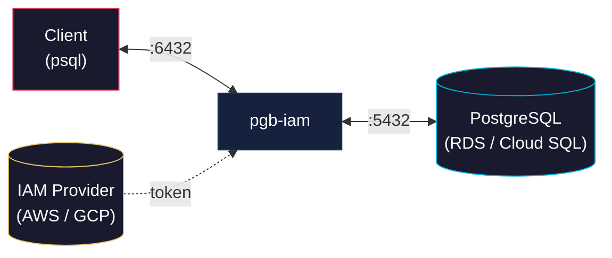
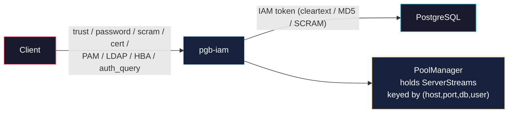
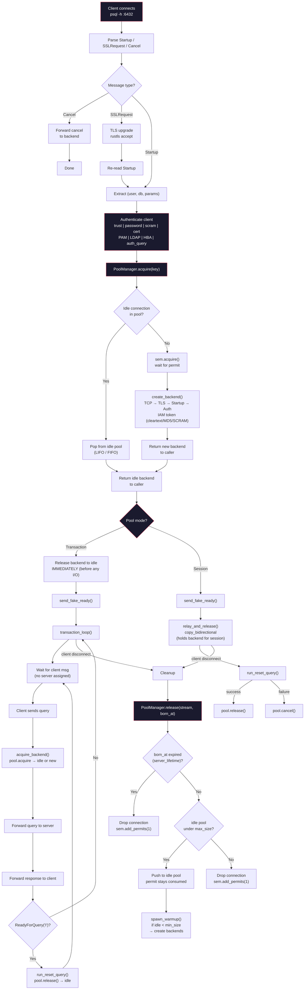

# pgb-iam — IAM-Aware PostgreSQL Connection Pooler

[](https://crates.io/crates/pgb-iam)
[](https://docs.rs/pgb-iam)
[](LICENSE-APACHE)

## Index

<ol>
  <li><a href="#the-problem">The Problem</a></li>
  <li><a href="#the-solution">The Solution</a>
    <ol type="a">
      <li><a href="#core-design">Core Design</a></li>
      <li><a href="#two-level-authentication">Two-Level Authentication</a></li>
      <li><a href="#why-rust">Why Rust</a></li>
    </ol>
  </li>
  <li><a href="#feature-comparison-with-pgbouncer">Feature Comparison</a></li>
  <li><a href="#quick-start">Quick Start</a></li>
  <li><a href="#pool-lifecycle">Pool Lifecycle</a></li>
  <li><a href="#architecture">Architecture</a></li>
  <li><a href="#configuration-reference">Configuration Reference</a>
    <ol type="a">
      <li><a href="#listen">Listen</a></li>
      <li><a href="#pool">Pool</a></li>
      <li><a href="#client-authentication">Client Authentication</a></li>
      <li><a href="#iam">IAM</a></li>
      <li><a href="#tls">TLS</a></li>
      <li><a href="#metrics">Metrics</a></li>
      <li><a href="#admin">Admin</a></li>
      <li><a href="#health-check">Health Check</a></li>
      <li><a href="#logging">Logging</a></li>
    </ol>
  </li>
  <li><a href="#authentication-methods">Authentication Methods</a></li>
  <li><a href="#license">License</a></li>
</ol>

---

## The Problem

PgBouncer is the de facto PostgreSQL connection pooler, but it has a glaring gap in 2025+: **IAM-based database authentication**.

Teams running PostgreSQL on AWS RDS or GCP Cloud SQL want to use IAM auth (short-lived tokens via AWS `GenerateDBAuthToken` or GCP's Cloud SQL IAM) instead of static passwords. However, PgBouncer's auth model is built around static password files (`userlist.txt`) or SCRAM authentication. Getting IAM tokens to work with PgBouncer requires:

- External cron jobs or sidecars that refresh tokens every ~15 minutes
- Writing tokens to files that PgBouncer re-reads via `auth_query`
- Complex `auth_user` setups with shadow tables
- No native token refresh — if a token expires, connections start failing until manual intervention

This is fragile, operationally expensive, and undermines the security benefits of IAM auth.

## The Solution

**pgb-iam** is a PostgreSQL connection pooler built from the ground up for cloud-native deployments. It natively understands IAM authentication and handles token lifecycle automatically.

### Core Design



### Two-Level Authentication



1. **Client connection**: Authenticates to pgb-iam locally via any of 8 methods: `trust`, `password` (cleartext), `scram-sha-256` (SASL), `cert` (TLS client certificate), `PAM`, `LDAP`, `hba` (pg_hba.conf-style rules), or `auth_query` (dynamic DB lookup)
2. **Backend connection**: pgb-iam authenticates to PostgreSQL using IAM tokens (AWS RDS `GenerateDBAuthToken` / GCP Cloud SQL IAM) — supports `cleartext`, `MD5`, and `SCRAM-SHA-256` SASL for the backend auth handshake
3. **Pooling**: Already-authenticated backend connections are stored in a per-`(host, port, db_user, dbname)` pool
4. **Token lifecycle**: Tokens are cached and auto-refreshed via background task (10-min TTL, 5-min refresh check)

### Why Rust

- **Performance**: Async I/O with Tokio — ideal for connection pooling, zero-cost abstractions, no GC pauses
- **Safety**: No buffer overflows or use-after-free in the critical network path
- **Ecosystem**: First-class AWS SDK, async Postgres protocol support, Prometheus instrumentation

## Feature Comparison with PgBouncer

### Pooling

| Feature | PgBouncer | pgb-iam | Notes |
|---|---|---|---|
| Session pooling | ✅ | ✅ | Server assigned for client lifetime |
| Transaction pooling | ✅ | ✅ | Server released on ReadyForQuery('I') |
| Statement pooling | ✅ | ❌ | Not implemented |
| Per-database pool size | ✅ | ✅ | `[pool.database_limits]` table |
| Per-user pool size | ✅ | ✅ | `[pool.user_limits]` table |
| Reserve pool | ✅ | ✅ | `reserve_size` — burst beyond `max_size` |
| LIFO / round-robin | ✅ | ✅ | LIFO default; `strategy = "fifo"` opt-in |
| Min pool size (warm-up) | ✅ | ✅ | `min_size` — background spawn after relay |

### Authentication

| Feature | PgBouncer | pgb-iam | Notes |
|---|---|---|---|
| Cleartext password | ✅ | ✅ | IAM token sent as cleartext |
| MD5 password | ✅ | ✅ | IAM token MD5-hashed with server salt |
| SCRAM-SHA-256 | ✅ | ✅ | Full SASL exchange (server + client) |
| PAM | ✅ | ✅ | Custom FFI — no external dependencies |
| LDAP | ✅ | ✅ | Async ldap3 bind + search + user verification |
| TLS client cert | ✅ | ✅ | `client_ca` config, `WebPkiClientVerifier` |
| HBA (host-based) | ✅ | ✅ | Inline matching by conn_type/db/user/address/TLS |
| `auth_query` (DB lookup) | ✅ | ✅ | `SELECT ... FROM pg_shadow WHERE usename = $1` |
| **AWS RDS IAM** | ❌ | ✅ | Full `GenerateDBAuthToken` integration |
| **GCP Cloud SQL IAM** | ❌ | ⚠️ | Stub only |
| **Auto token refresh** | ❌ | ✅ | Background task, 5-min cycle |

### TLS

| Feature | PgBouncer | pgb-iam | Notes |
|---|---|---|---|
| Client TLS | ✅ Full | ✅ | rustls accept with optional client CA |
| Server TLS | ✅ Full | ⚠️ | `connect_with_tls: bool` only |
| Cipher / protocol selection | ✅ | ✅ | Configurable via `ciphers` and `min_protocol_version` |
| Client cert validation | ✅ | ✅ | `client_ca` → `WebPkiClientVerifier` |

### Protocol

| Feature | PgBouncer | pgb-iam | Notes |
|---|---|---|---|
| Wire protocol (startup, auth, relay) | ✅ | ✅ | Full basic flow |
| SSLRequest / TLS upgrade | ✅ | ✅ | rustls accept/connect |
| Extended query protocol | ✅ | ⚠️ | Message types defined; relayed as opaque bytes |
| Prepared statement tracking | ✅ | ✅ | Tracked per connection; DEALLOCATE on release |
| Cancel request | ✅ | ✅ | Parsed and forwarded on separate backend connection |
| Replication protocol | ✅ | ❌ | Not implemented |

### Timeouts

| Feature | PgBouncer | pgb-iam | Notes |
|---|---|---|---|
| `server_idle_timeout` | ✅ | ✅ | `idle_timeout_secs` in config |
| `server_lifetime` | ✅ | ✅ | `server_lifetime_secs` — enforced on pool release |
| `server_connect_timeout` | ✅ | ✅ | `server_connect_timeout_secs` — in `create_backend` |
| `query_timeout` | ✅ | ❌ | Not implemented |
| `client_idle_timeout` | ✅ | ✅ | Enforced in `transaction_loop` |
| `transaction_timeout` | ✅ | ✅ | Enforced in `transaction_loop` |
| `query_wait_timeout` | ✅ | ✅ | Enforced in `transaction_loop` |

### Admin & Monitoring

| Feature | PgBouncer | pgb-iam | Notes |
|---|---|---|---|
| Admin console (`psql pgbouncer`) | ✅ | ❌ | HTTP JSON API instead |
| SHOW commands (stats, pools, clients) | ✅ | ❌ | `GET /stats`, `GET /health` |
| RECONNECT / PAUSE / RESUME / RELOAD | ✅ | ❌ | No live admin commands |
| Online restart (`-R`) | ✅ | ❌ | Restart required for config changes |
| Prometheus metrics | ⚠️ via SHOW + exporter | ✅ | Native `GET /metrics` |

### Configuration

| Feature | PgBouncer | pgb-iam | Notes |
|---|---|---|---|
| Config format | INI | TOML | Cleaner format |
| Per-database settings | ✅ | ✅ | `[pool.database_limits]` table |
| Per-user settings | ✅ | ✅ | `[pool.user_limits]` table |
| Online reload (SIGHUP) | ✅ | ❌ | Not implemented |

### Other

| Feature | PgBouncer | pgb-iam | Notes |
|---|---|---|---|
| Unix sockets | ✅ | ❌ | TCP only |
| SO_REUSEPORT (multi-process) | ✅ | ❌ | Single-process async |
| `server_reset_query` | ✅ | ✅ | `DISCARD ALL` (configurable) |
| `PoolManager` + `PoolKey` | ❌ | ✅ | Keyed by `(host, port, db_user, dbname)` |
| `ServerStream` (Plain/TLS) | ❌ | ✅ | Unified I/O enum |
| Two-level auth (local + IAM) | ❌ | ✅ | Unique to pgb-iam |

## Quick Start

```bash
# Build
cargo build --release

# Configure
cp config.toml config.toml
# edit config.toml with your RDS endpoint and IAM settings

# Run
./target/release/pgb-iam -c config.toml

# Metrics
curl http://127.0.0.1:9090/metrics
```

## Pool Lifecycle



## Architecture

```
src/
├── main.rs          Entry point, config loading, runtime setup
├── config/          TOML config deserialization (listen, pool, client_auth, iam, tls, metrics, admin, health_check)
├── pool/            PoolManager — maps of pools keyed by (host, port, db_user, dbname), acquire/release lifecycle
├── proxy/           TCP relay + IAM auth injection + pool mode dispatch
│   ├── mod.rs       Handler: client TLS → startup → local auth → pool acquire → relay
│   ├── health.rs    Periodic backend health checks (TCP connect)
│   └── admin.rs     HTTP admin API (GET /stats, GET /health)
├── pgproto/         PostgreSQL wire protocol parser (startup, SSL, auth messages, relay)
├── auth/            IAM token providers, SCRAM, HBA, auth_query, PAM, LDAP + token cache
│   ├── aws.rs       AWS RDS GenerateDBAuthToken
│   ├── gcp.rs       GCP Cloud SQL IAM (stub)
│   ├── cache.rs     Token cache with auto-refresh (10-min TTL)
│   ├── scram.rs     SCRAM-SHA-256 client + server
│   ├── hba.rs       HBA rule parser (conn_type/db/user/address matching)
│   ├── auth_query.rs Dynamic password lookup from PostgreSQL
│   ├── pam_ffi.rs   Minimal PAM FFI (libpam bindings)
│   ├── pam.rs       PAM authentication wrapper
│   └── ldap.rs      LDAP authentication (async ldap3)
├── tls/             TLS accept/connect (rustls + tokio-rustls)
└── metrics/         Prometheus endpoint (GET /metrics)
```

## Configuration Reference

### Listen — TCP bind address

- **addr** (`string`, default: `"127.0.0.1"`) — IP address to bind
- **port** (`integer`, default: `6432`) — TCP port to listen on

---

### Pool — Connection pool behavior

- **mode** (`"session"` | `"transaction"`, default: `"session"`) — `"session"` holds a backend for the entire client lifetime; `"transaction"` releases it after each `ReadyForQuery('I')`
- **strategy** (`"lifo"` | `"fifo"`, default: `"lifo"`) — idle backend reuse order
- **max_size** (`integer`, **required**) — maximum backend connections in the pool (excludes reserve)
- **min_size** (`integer`, default: `0`) — background warm-up target; this many connections are spawned after the first client relay
- **reserve_size** (`integer`, default: `0`) — extra capacity beyond `max_size` using a separate semaphore, for burst traffic
- **idle_timeout_secs** (`integer`, default: `300`) — idle connection is dropped after this many seconds
- **server_lifetime_secs** (`integer`, default: `3600`) — connection is dropped when its age exceeds this (enforced on release)
- **server_connect_timeout_secs** (`integer`, default: `15`) — max seconds for TCP + TLS + PostgreSQL handshake per backend
- **client_idle_timeout_secs** (`integer`, default: `0`) — max idle time without a transaction; `0` disables
- **transaction_timeout_secs** (`integer`, default: `0`) — max duration of a single transaction; `0` disables
- **query_wait_timeout_secs** (`integer`, default: `0`) — max seconds a query waits for a backend; `0` disables
- **target_host** (`string`, **required**) — PostgreSQL hostname or IP
- **target_port** (`integer`, **required**) — PostgreSQL port
- **dbname** (`string`, **required**) — default database name
- **db_user** (`string`, **required**) — PostgreSQL user pgb-iam connects as (must match IAM user)
- **server_reset_query** (`string`, default: `"DISCARD ALL"`) — SQL sent to reset backend before returning to pool
- **client_max** (`integer`, default: `0`) — maximum concurrent client connections; `0` is unlimited

Any timeout set to `0` is disabled (equivalent to infinite).

#### Database limits

Override `max_size`, `min_size`, and `reserve_size` per database:

```toml
[pool.database_limits]
"postgres" = { max_size = 2, min_size = 1, reserve_size = 1 }
"myapp" = { max_size = 50 }
```

Unset values inherit from the top-level `[pool]` block.

#### User limits

Same structure, keyed by `db_user`:

```toml
[pool.user_limits]
"admin" = { max_size = 15 }
"readonly" = { max_size = 5 }
```

---

### Client Authentication — how pgb-iam verifies clients

Only one auth block is active at a time (unless using HBA, which dispatches per-connection).

- **type** (`"trust"` | `"password"` | `"scram-sha-256"` | `"cert"` | `"pam"` | `"ldap"` | `"hba"` | `"auth_query"`, **required**)
- **password** (`string`, optional) — static password for `password` / `scram-sha-256`
- **client_ca** (`string`, optional) — path to CA PEM for `cert` auth (requires TLS enabled)
- **pam_service** (`string`, default: `"pgb-iam"`) — PAM service name

#### Auth methods

- **trust** — accepts all connections without credentials
- **password** — cleartext password, matched against `password` field or `auth_query`
- **scram-sha-256** — full SASL SCRAM-SHA-256 exchange
- **cert** — TLS client certificate validated against `client_ca`
- **pam** — delegates to system PAM via `pam_service`
- **ldap** — LDAP bind + search (see LDAP config below)
- **hba** — evaluates rules in order (see HBA rules below)
- **auth_query** — dynamic password lookup from PostgreSQL

#### Auth query (dynamic password lookup)

Required when `type` is `"password"`, `"scram-sha-256"`, or `"hba"` and passwords come from the database:

- **user** (`string`) — PostgreSQL user for the lookup connection
- **query** (`string`) — SQL returning the password; `$1` is replaced with the client username

#### LDAP

Required when `type` is `"ldap"`:

- **uri** (`string`) — e.g., `"ldap://ldap.example.com"`
- **bind_dn** (`string`) — admin bind DN
- **bind_password** (`string`) — admin bind password
- **search_base** (`string`) — base DN for user search
- **search_filter** (`string`) — filter with `$1` for client username, e.g., `"(uid=$1)"`

#### HBA rules

Evaluated in order; the first match wins. If no rule matches, the connection is rejected.

- **type** (`"host"` | `"hostssl"` | `"hostnossl"`)
- **database** (`string[]`) — `["all"]`, `["sameuser"]`, or specific DB names
- **user** (`string[]`) — `["all"]` or specific usernames
- **address** (`string`) — CIDR notation, e.g., `"0.0.0.0/0"`
- **auth** (`"trust"` | `"reject"` | `"password"` | `"scram-sha-256"` | `"cert"` | `"pam"` | `"ldap"`)

---

### IAM — backend authentication to PostgreSQL

When configured, pgb-iam generates short-lived IAM tokens instead of using static passwords.

- **provider** (`"aws"` | `"gcp"` | `"none"`)
- **region** (`string`) — AWS region (required for AWS)
- **instance_host** (`string`) — database hostname (must match IAM policy)
- **instance_port** (`integer`, default: `5432`)
- **db_user** (`string`) — IAM database user

**AWS** — Uses `GenerateDBAuthToken` via the AWS SDK. Credentials resolved at runtime: environment variables → `~/.aws/credentials` → `~/.aws/login/cache/*.json` (supports `aws login` extension).

**GCP** — Resolves tokens from `GCP_ACCESS_TOKEN` env var → GCP metadata server (`metadata.google.internal`). Requires Cloud SQL Client IAM role.

**Caching** — Tokens are cached for 10 minutes with a background refresh every 5 minutes.

---

### TLS

- **enabled** (`boolean`, default: `false`) — enable TLS for client connections
- **cert_path** (`string`, default: `"server.crt"`) — server certificate PEM
- **key_path** (`string`, default: `"server.key"`) — server private key PEM
- **connect_with_tls** (`boolean`, default: `false`) — connect to PostgreSQL with TLS (required for RDS IAM)
- **backend_ca_path** (`string`, optional) — backend CA bundle PEM (e.g., RDS `global-bundle.pem`)
- **ciphers** (`string[]`, optional) — allowed cipher suites, e.g., `["TLS13_AES_256_GCM_SHA384"]`
- **min_protocol_version** (`string`, optional) — minimum TLS version, e.g., `"TLSv1.2"`

When `enabled`, clients must connect with TLS. Setting `client_ca` enables client certificate auth.

When `connect_with_tls` is set, all backend connections use TLS.

---

### Metrics — Prometheus endpoint

- **enabled** (`boolean`, default: `true`)
- **listen_addr** (`string`, default: `"127.0.0.1"`)
- **listen_port** (`integer`, default: `9090`)

Exposes `GET /metrics` (Prometheus text format) and `GET /health` (`"ok"`).

**Metrics**: `pgb_iam_clients`, `pgb_iam_client_max`, `pgb_iam_server_active`, `pgb_iam_server_idle`, `pgb_iam_server_max`, `pgb_iam_server_reserve`, `pgb_iam_server_min`.

---

### Admin — HTTP API

- **enabled** (`boolean`, default: `true`)
- **listen_addr** (`string`, default: `"127.0.0.1"`)
- **listen_port** (`integer`, default: `9091`)

Routes:

- `GET /stats` — JSON pool statistics (`idle`, `active`, `max`, `reserve`, `min`)
- `GET /health` — JSON health status (`healthy`, `last_error`, `last_check_ago_secs`)

---

### Health Check — backend monitoring

Periodically checks PostgreSQL reachability via TCP connect.

- **enabled** (`boolean`, default: `true`)
- **interval_secs** (`integer`, default: `30`)
- **timeout_secs** (`integer`, default: `5`)

---

### Logging — output format and channels

Each output channel is configured independently.

- **stderr** (`"text"` | `"json"`, default: `"text"`) — format for stderr
- **stdout** (`"text"` | `"json"`, optional) — enables stdout output; absent means disabled
- **pipeline_path** (`string`, optional) — file path for pipeline output
- **pipeline_format** (`"text"` | `"json"`, default: `"json"`) — format for the pipeline file

**Examples:**

```toml
# Text on stderr only (default)
[logging]
```

```toml
# Text on stderr + JSON on stdout
[logging]
stdout = "json"
```

```toml
# JSON to a file for pipeline ingestion
[logging]
stderr = "json"
pipeline_path = "/var/log/pgb-iam/pipeline.json"
pipeline_format = "json"
```

Every log event includes structured fields: `timestamp`, `level`, `component`, `action`, `hostname`, `message`, plus event-specific fields such as `clients`, `servers_active`, `db_user`, `db_name`.

## Authentication Methods

### Client Auth (method → how pgb-iam verifies the client)

| Method | Description |
|---|---|
| `trust` | No password required — accepts all connections |
| `password` | Cleartext password — matched against `password` field or `auth_query` |
| `scram-sha-256` | SASL SCRAM-SHA-256 exchange — password from `password` or `auth_query` |
| `cert` | TLS client certificate — validated against `client_ca` root |
| `pam` | Delegates to system PAM service (e.g., `/etc/pam.d/pgb-iam`) |
| `ldap` | Binds as admin, searches for user DN, then rebinds as user |
| `hba` | Evaluates `hba_rules` in order — each rule specifies method + filter |
| `auth_query` | Queries PostgreSQL (`SELECT passwd FROM pg_shadow`) for dynamic password |

### Backend Auth (how pgb-iam authenticates to PostgreSQL)

Once the client is authenticated, pgb-iam connects to PostgreSQL using IAM tokens or passwords. The backend auth flow automatically selects the method requested by the server:

1. **Cleartext** — IAM password token sent directly
2. **MD5** — IAM token MD5-hashed with server salt (`md5{hash}`)
3. **SCRAM-SHA-256** — Full SASL client exchange using IAM token as password

### HBA Rule Evaluation

HBA rules are processed **in order** for each connection. The first matching rule determines the auth method:

```
[[client_auth.hba_rules]]
type = "hostssl"     # hostssl | hostnossl | host | local
database = ["all"]   # "all", "sameuser", or specific DB names
user = ["all"]       # "all" or specific user names
address = "0.0.0.0/0"  # CIDR notation
auth = "cert"        # trust | reject | password | scram-sha-256 | cert | pam | ldap
```

If no rule matches, the connection is **rejected**.

## License

MIT
